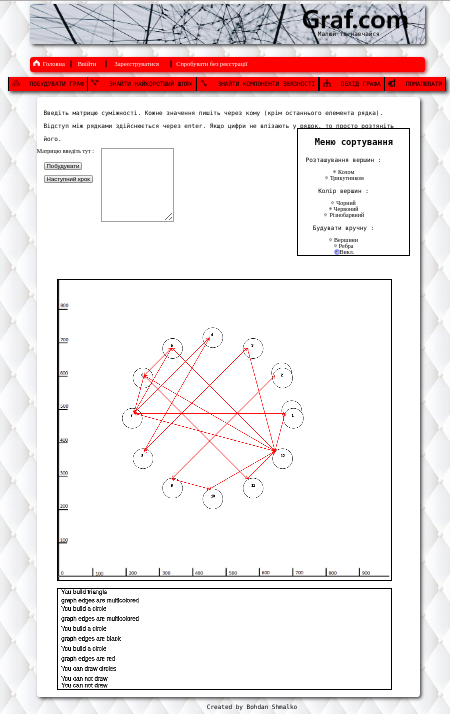
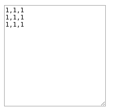
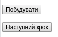
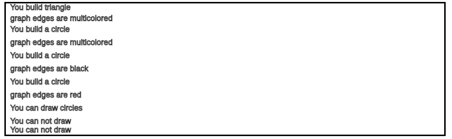
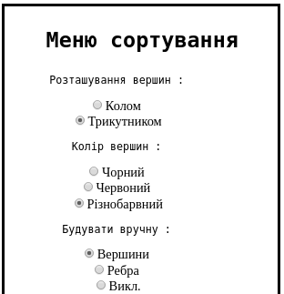

# Графи : графічне оформлення алгоритму Пріма (на canvas)

На даному етапі, я маю декілька сторінок html з яких тільки одна виконує якусь
 роботу - малює граф по матриці суміжності, або вручну, а також обходе цей граф
 (знаходе найкоротший шлях) за алгоритмом Пріма.

 

## Що є на даній сторінці?

 + Поле вводу матриці вагів графа;
 + Кнопки побудови та обходу графа;
 + Меню сортування, яке також дає можливість побудови вручну;
 + Графік, на якому будується граф;
 + Поле, в якому описуються ваші дії;

### Поле вводу матриці вагів графа

Для парсингу матриці я використав регулярні вирази, а також для розбиття - цикл.

    const matrix = input => {
      const P = [];
      const arr = input.match(/\d+/g).map(Number);
      storage.tops = Math.sqrt(arr.length);
      if (storage.tops % 1 !== 0) return false;
      let count1 = -1;
      let count2;
      for (let i = 0; i < arr.length; i++) {
        if (i % sqrt === 0) {
          count1++;
          P[count1] = [];
          count2 = 0;
        }
        P[count1][count2] = arr[i];
        count2++;
      }
      return P;
    };

### Кнопки побудови та обходу графа

Ці кнопки часто використовуються. Приклад використання:

    knp1.onclick = function create() {
      clf();
      const p = document.getElementById('ar').value;
      try {
        storage.array = matrix(p);;
        countrina = storage.array.length;
        if (document.getElementById('location2').checked) OnTriangle();
        else if (document.getElementById('location1').checked) OnCircle();
        document.getElementById('knp2').onclick = function() {
          prima();
        };
        } catch (e) {
          observable.send('You have entered the wrong matrix');
        }
      };

### Поле, в якому описуються ваші дії

Для створення цього поля я використав патерн Спостерігач (Observer), де в якості спостерігачів виступають рядки цього поля.

    function Observable() {
      //array for storing observers
      storage.observers = [];
      //send message for all observers
      this.send = function(msg) {
        for (let i = 0; i < storage.observers.length; i++) {
          storage.observers[i].told(msg);
        }
      };
      // add new observer
      this.add = function(observer) {
        storage.observers.push(observer);
      };
    }

    function Observer(job) {
      //add method told that call callback
      this.told = function(msg) {
        job(msg);
      };
    }

    //object that storage messages
    const beams = {
      count: false,
      line1: '',
      line2: '',
      line3: '',
      line4: '',
      line5: '',
      line6: '',
      line7: '',
      line8: '',
      line9: '',
      line10: '',
      line11: '',
    };

    //create new observer
    const obs1 = new Observer(((msg) => {
      ctx2.clearRect(0, 0, 1000, 300);
      if (beams.line11 !== '') beams.line1 = beams.line2;
      if (beams.line1 !== '') beams.count = true;
      else if (beams.line1 === '') beams.line1 = msg;
      xsstring(10, 5, beams.line1);
    }));

    observable.add(obs1);

### Меню сортування, яке також дає можливість побудови вручну

Дане меню ділиться на дві частини :

1. Розташування вершин і колір вершин;
2. Будувати вручну;

#### Розташування вершин і колір вершин

Частина меню, для роботи якої використовується патерн Декоратор :

    //class that have method .get()
      function clearCanvas() {
        this.get = function() {
          //clf();
          console.log('all clear');
        };
      }

      //class that accepts the object
      function Decorator(obj) {
        this.obj = obj;
      }

      //inherit from class clearCanvas
      Decorator.prototype = Object.create(clearCanvas.prototype);
      //create constructor, returns a reference to a function
      Decorator.prototype.constructor = Decorator;

      function Triangle(obj) {
        //take this property obj, call another object
        Decorator.call(this, obj);
        //resubmit method get()
        this.get = function() {
          this.obj.get();
          //talk to the observer
          observable.send('You build triangle');
          //draws circles along the triangle
          rounds();
        };
      }

      //inherit from class Decorator
      Triangle.prototype = Object.create(Decorator.prototype);
      //create constructor
      Triangle.prototype.constructor = Triangle;

#### Будувати вручну

Частина меню, для роботи якої використовується патерн Стратегія :

    //counter that say number of circles
    let countrina = storage.tops;

    //class parent
    function Parent() {}
      //add method start()
      Parent.prototype.start = function() {
        console.log('strategy work');
      };

      function DrawTops() {}
        //resubmit method start()
        DrawTops.prototype.start = function() {
          //say to observers
          observable.send('You can draw circles');
          //off drawing arrows
          finalArrow();
          //change function on click
          c.onclick = function manually(event) {
            countrina++;
            const x = event.offsetX;
            const y = event.offsetY;
            ctx.beginPath();
            ctx.strokeStyle = 'black';
            ctx.arc(x, y, 30, 0, 2 * storage.pi, true);
            ctx.strokeText(countrina, x, y);
            ctx.stroke();
          };
        };

        //connect with the class parent
        Object.setPrototypeOf(DrawTops.prototype, Parent.prototype);

        //class that have act
        function Context(act) {
          this.act = act;
        }

        //add method to class Context
        Context.prototype.process = function() {
          return this.act.start();
        };

### Графік, на якому будується граф

Розташування вершин графа можна побудувати в вигляді трикутника і кола (а також в ручну). Розглянемо побудову на прикладі кола:

1. Створив свої функції малювання, які основуються на функціях canvas.

        //easier to draw lines
        function lines(x1, x2, y1, y2, color) {
          let k = storage.Colors[color];
          if (k === undefined) k = 'black';
          ctx.beginPath();
          ctx.strokeStyle = k;
          ctx.moveTo(x1 - 10, storage.height - y1 - 215);
          ctx.lineTo(x2 - 10, storage.height - y2 - 215);
          ctx.stroke();
        }

        //easier to draw arrows
        function arrows(x1, x2, y1, y2, color) {
          const n = 10;
          const angle = Math.atan2(y2 - y1, x2 - x1);
          lines(x1, x2, y1, y2, color);
          ctx.lineTo(
            x2 - 10 - n * Math.cos(angle - Math.PI / 6),
            storage.height - (y2 - n * Math.sin(angle - Math.PI / 6)) - 215
            );
            ctx.moveTo(x2 - 10, storage.height - y2 - 215);
            ctx.lineTo(
              x2 - 10 - n * Math.cos(angle + Math.PI / 6),
              storage.height - (y2 - n * Math.sin(angle + Math.PI /   6)) - 215
              );
              ctx.stroke();
            }

        //easier to write
        function xstring(x, y, str) {
          ctx.beginPath();
          ctx.strokeStyle = 'black';
          ctx.strokeText(str, x, storage.height - y - 215);
          ctx.stroke();
        }

        //easier to draw circles
        function xarc(x, y, radius, duga) {
          ctx.beginPath();
          ctx.strokeStyle = 'black';
          ctx.arc(x + 15, storage.height - y - 185, radius, 0, duga, true);
          ctx.stroke();
        }

2. Створив алгоритм побудови кола :

        //builds circles from the matrix
        function circletops(matrix, radius) {
          clf();
          countrina = storage.tops;
          storage.X = [];
          storage.Y = [];

          for (let i = 0; i < matrix.length; i++) {
            storage.X[i] = ((2 * storage.pi) / matrix.length) * i;
            storage.Y[i] = ((2 * storage.pi) / matrix.length) * i;
            xarc(
              Math.cos(storage.X[i]) * (matrix.length + radius + 200) + 450,
              Math.sin(storage.Y[i]) * (matrix.length + radius + 200) + 300,
              radius,
              storage.pi * 2
            );
            xstring(
              Math.cos(storage.X[i]) * (matrix.length + radius + 200) +
                radius / 2 +
                445,
              Math.sin(storage.Y[i]) * (matrix.length + radius + 200) -
                radius / 2 +
                290,
              i + 1
            );
          }
        }

        //builds arrows from the matrix
        function circlerebra(matrix, radius, color) {
          let k;
          for (let i = 0; i < matrix.length; i++) {
            for (let j = 0; j < matrix.length; j++) {
              if (color === 'other')
                k = Math.floor(Math.random() * storage.Colors.length);
              else if (color === 0) k = 0;
              else k = 2;
              if (matrix[j][i] >= 1) {
                storage.a =
                  radius / 2 +
                  Math.cos(storage.X[j]) * (matrix.length + radius + 200) +
                  (Math.cos(storage.X[j] + storage.pi) * radius) / 2 +
                  450;
                storage.b =
                  radius / 2 +
                  Math.cos(storage.X[i]) * (matrix.length + radius + 200) +
                  (Math.cos(storage.X[i] + storage.pi) * radius) / 2 +
                  450;
                storage.c =
                  -radius / 2 +
                  Math.sin(storage.Y[j]) * (matrix.length + radius + 200) +
                  (Math.sin(storage.Y[j] + storage.pi) * radius) / 2 +
                  300;
                storage.d =
                  -radius / 2 +
                  Math.sin(storage.Y[i]) * (matrix.length + radius + 200) +
                  (Math.sin(storage.Y[i] + storage.pi) * radius) / 2 +
                  300;
                if (j === i) {
                  xarc(storage.b - 5, storage.d + 38, 30, 0.85 * storage.pi);
                } else {
                  arrows(storage.b, storage.a, storage.d, storage.c, k);
                }
              }
            }
          }
        }

        //builds circles graph
        function createCirclesGraph(matrix, radius, color) {
          circletops(matrix, radius);
          circlerebra(matrix, radius, color);
        }

### Обхід за алгоритмом Пріма

    //algorithm Prima
    function prima() {
      const array = storage.array;
      clf();
      let a = 0;
      const skok = [];
      let co = 0;
      const rad = [];
      const zk = [];
      for (let i = 0; i < storage.tops; i++) {
        rad[i] = 0;
        skok[i] = 0;
      }
      let n = 0;
      for (let i = 0; i < storage.tops; i++) {
        for (let j = i; j < storage.tops; j++) {
          if (array[i][j] !== 0) {
            a = i;
            n = 1;
            break;
          }
        }
        if (n !== 0) {
          break;
        }
      }

      const U = [];
      U[0] = a;
      let p = 1;

      for (let i = 0; i < storage.tops; i++) {
        array[i][a] = 0;
      }

      form1(a + 1);

      function r() {
        const N = [0, 0, Infinity];
        for (let i = 0; i < U.length; i++) {
          for (let j = 0; j < storage.tops; j++) {
            const m = U[i];
            if (array[m][j] !== 0) {
              if (N[2] > array[m][j]) {
                N[0] = U[i];
                N[1] = j;
                N[2] = array[U[i]][j];
              }
            }
          }
        }

        const s = N[0];
        zk[co] = N[0];
        zk[co + 1] = N[1];
        co += 2;
        skok[s]++;
        U[p] = N[1];
        p++;

        for (let i = 0; i < storage.tops; i++) {
          array[i][N[1]] = 0;
        }
        if ( N[0] !==  N[1]) {
          form1(N[1] + 1);
          form2(N[0] + 1, N[1] + 1, N[2], true, 'other');
        };
      }
      document.getElementById('knp2').onclick = function() {
        r();
      };
    }

    document.getElementById('knp2').onclick = function() {
      prima();
    };
